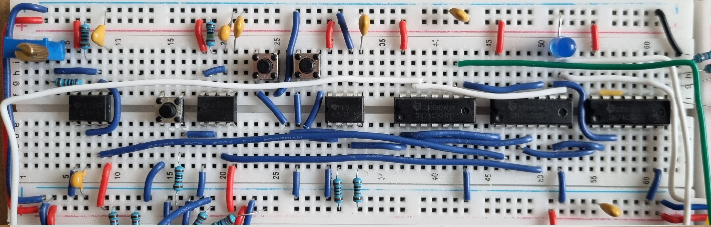
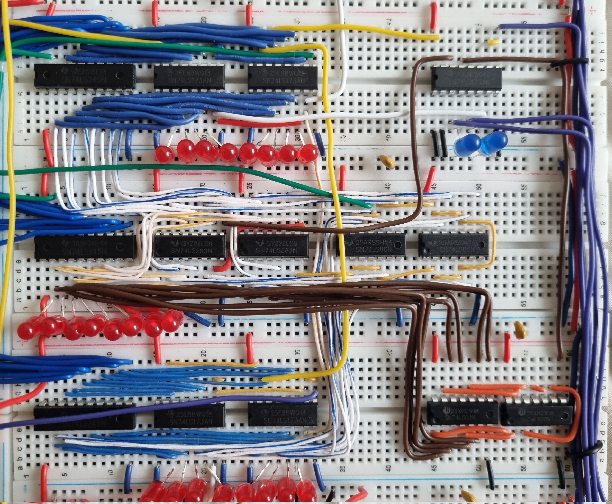
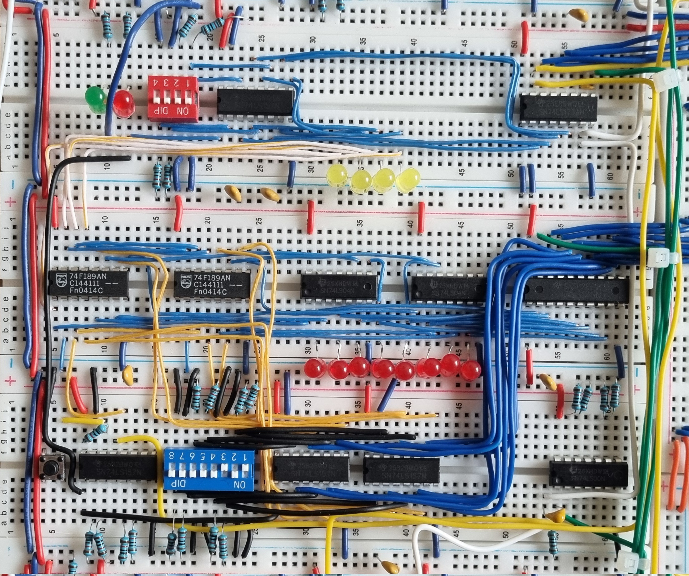
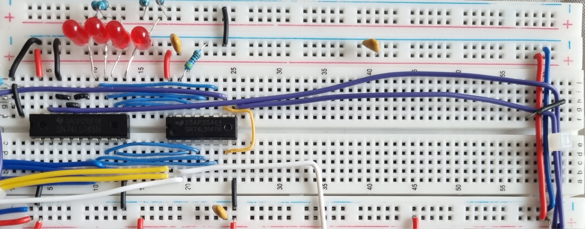
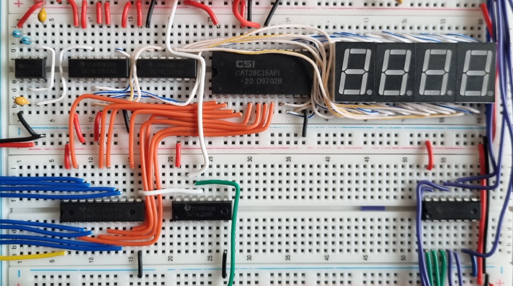
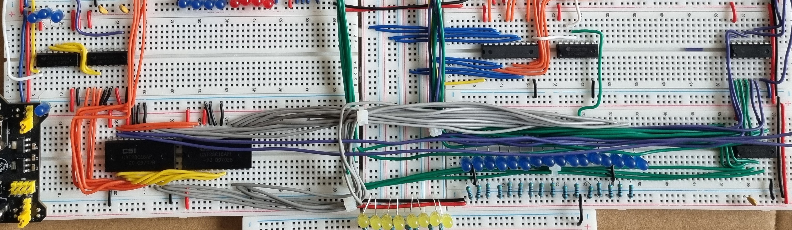
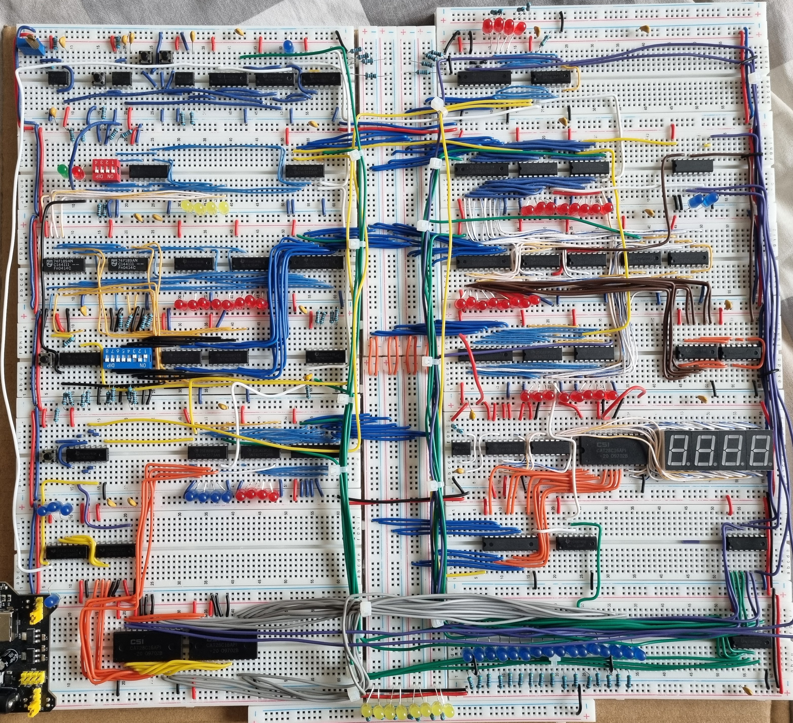

# Build Photos

A visual walkthrough of the build process, module by module.

---

## 1. Clock Module

The first module built — generates the heartbeat of the entire computer. Supports two modes: automatic (variable speed) and manual.

*74LS04 inverter, two 555 timers, and a two button switch for mode selection.*

---

## 2. Registers & ALU & Flags

Two 8-bit general-purpose registers, each made from two 74LS173 4-bit register chips. Values are read/written via the shared bus.

*Red LEDs show the current value stored in each register.*

*On the right you can also see the flag register (carry | zero)*

---

## 3. RAM Module

16 bytes of RAM using 74F189 chips (they output inverted data, so inverters are needed on the output). A Memory Address Register (MAR) selects which address to read/write.

*DIP switches on the left allow manual address and data entry during programming.*

---

## 4. Program Counter

A 4-bit binary counter (74LS163) that increments every clock cycle and drives the 4-bit memory address. Can be loaded with a jump address from the bus.

---

## 5. Output Register & 7-Segment Display

Latches the bus value on demand and drives four 7-segment displays via 107 and 139 chips. Displays unsigned or signed decimal output.

---

## 6. Control Logic (Microcode ROM)

The most complex module. Two EEPROMs store the microcode that maps each instruction + step to a set of control signals. This is what makes the CPU actually *execute* instructions.

---

## 7. Full Build

All modules connected together on the bus. The yellow LEDs along the bottom show the 8-bit bus state in real time.

---

[📋 Other Info](./OTHER.md) 

[EEPROM Code](./eeprom-programmer/README.md)